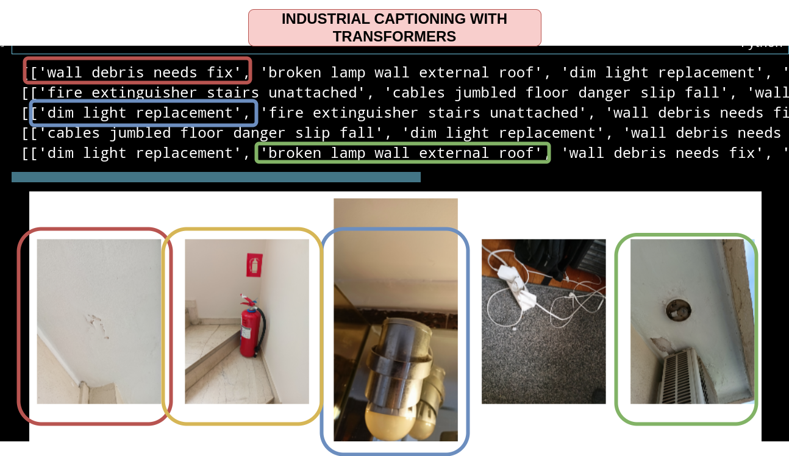

# 🧠 Project Title: Industrial Captioning

This project demonstrates a 2 step pipeline to efficiently caption 
and also do retrieval for multimodal industrial datasets
The idea is to finetune specific layers of the 2 transformers of the CLIP multimodal model (https://github.com/openai/CLIP) so that we can teach the model specific domain knowledge. The results suggest that finetuning specific layers is possible when using appropriately sized datasets and augmentation can also be beneficial.


<p align="center">
  
</p>


---

### 📘 View the Notebook

[](./demo-notebook.ipynb)

## 📦 Requirements

To run this demo project locally (optional), you'll need:

- Python 3.10+
- Git (for cloning the repo)
- Huggingface and accepting meta's (https://huggingface.co/meta-llama/Llama-2-7b-chat-hf) terms and conditions if you want to also run the caption correction part of the project

For Python-specific setup:

- All Python dependencies are listed in `requirements.txt`
- The Datasets and Models structure is created after cloning the project
and then running the python module `creating_datasets.py`.

---

## 🚀 How to Run the Demo (Optional)

> 💡 Skip this if you're just here to view the notebook — everything is pre-rendered.

The demo is available 
- In the demo we present:
    - caption retrieval
    - Image retrieval
    - Caption correction using LLAMA2 
    - We also calculate and save the embeddings
    - We calculate the ROUGE score for the demo dataset

If you'd like to run the demo project locally:

### 🐳 Using Python

- Clone the repo
- Create a python virtual environment 
- Install the requirements
- cd into training_and_evaluation
- Run `creating_datasets.py`
- After that the directory structure is created and you need to copy all files from `demo_dataset` into the `src/training_and_evaluation/Datasets/original/` directory
- Run the notebook !

### Future steps
- Add unit testing
- Add function type hints
- Containerize the model

``````
